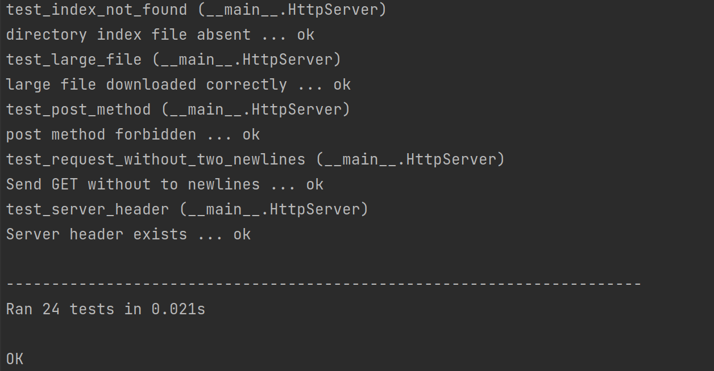
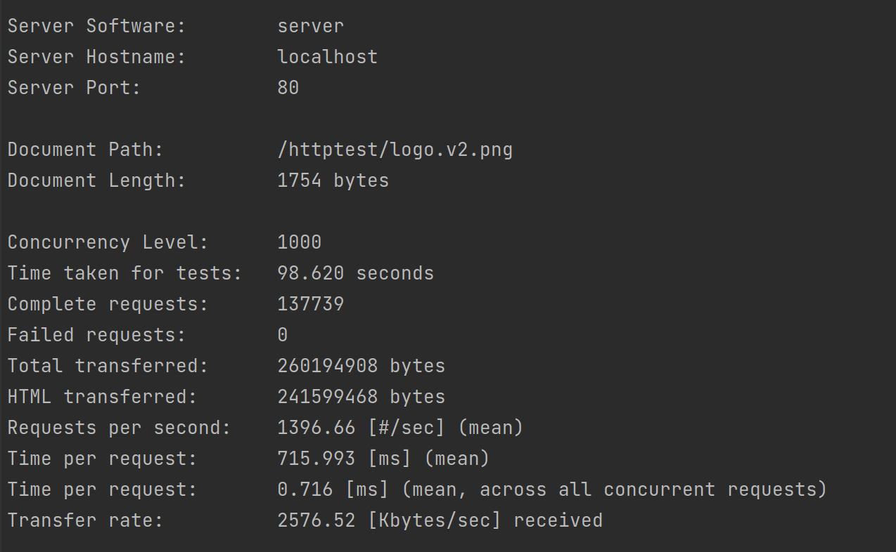
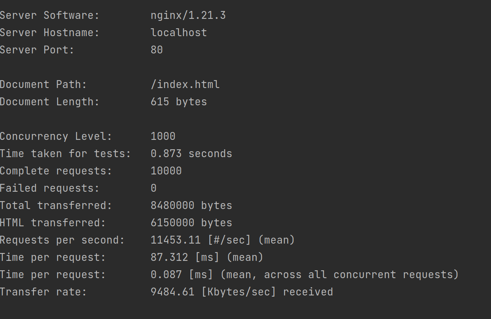

# TP_Highload_Web-server

## ATTENTION ##
Server needs some time to shut down to kill all threads.
* To start server in docker
```
sudo docker build  -t web-server .
docker run -p 80:80 -d web-server
```
* To run tests
```
./http-test-suite/httptest.py
```

## Requirements ##

* Respond to `GET` with status code in `{200,404,403}`
* Respond to `HEAD` with status code in `{200,404,403}`
* Respond to all other request methods with status code `405`
* Directory index file name `index.html`
* Respond to requests for `/<file>.html` with the contents of `DOCUMENT_ROOT/<file>.html`
* Requests for `/<directory>/` should be interpreted as requests for `DOCUMENT_ROOT/<directory>/index.html`
* Respond with the following header fields for all requests:
  * `Server`
  * `Date`
  * `Connection`
* Respond with the following additional header fields for all `200` responses to `GET` and `HEAD` requests:
  * `Content-Length`
  * `Content-Type`
* Respond with correct `Content-Type` for `.html, .css, js, jpg, .jpeg, .png, .gif, .swf`
* Respond to percent-encoding URLs
* Correctly serve a 2GB+ files
* No security vulnerabilities

## Results ##
Tests are passing



Server



nginx




